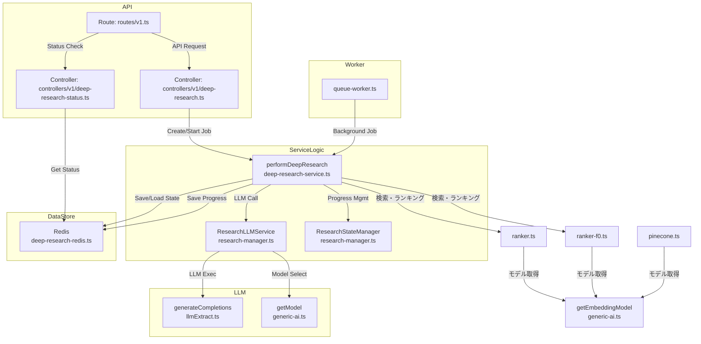

# FireCrawl DeepResearch 実装・拡張ガイド

## 1. 概要

FireCrawl DeepResearchは、LLM（大規模言語モデル）を活用してWebリサーチを自動化する機能です。APIリクエスト受付から検索・分析・レポート生成までを一貫して処理します。複数のAIプロバイダー（OpenAI、Google Gemini、Azure OpenAIなど）に対応しており、環境変数を適切に設定するだけで切り替えできます。

### 1.1 機能の構成と流れ

1. **APIエンドポイント**
    - `/deep-research` でジョブ作成
    - `/deep-research/:jobId` でジョブ状態取得
2. **コントローラー層**
    - `deep-research.ts` – リサーチジョブ作成を担当
    - `deep-research-status.ts` – ジョブ状態取得を担当
3. **サービス層**
    - `performDeepResearch` – ワークフロー全体の制御
    - `ResearchLLMService` – LLMを利用した検索クエリ生成、分析、レポート作成
    - `ResearchStateManager` – リサーチ処理の状態管理
4. **データストア**
    - Redisデータベースを使用してジョブの進捗、状態、結果を保存/取得
5. **ワーカー層**
    - バックグラウンドでジョブを実行し、UIブロックなしで処理

---

## 2. セットアップと起動方法

### 2.1 環境変数ファイルの準備

FireCrawl DeepResearchを起動する前に、必要な環境変数を設定する必要があります。プロジェクトルートディレクトリにある `.env.sample` ファイルを `.env` としてコピーし、必要な設定を行います。

```bash
# .env.sample ファイルを .env にコピー
cp .env.sample .env

# エディタで開いて編集
nano .env
# または
vim .env
```

`.env` ファイルには、使用するAIプロバイダー（Google Gemini、Azure OpenAI、OpenAIなど）に応じて、必要なAPIキーや設定を記入します。

主な設定項目：

- `MODEL_PROVIDER` - 使用するAIプロバイダー（"google"、"azure"、"openai"など）
- `MODEL_NAME` - 使用するモデル名（プロバイダーに対応した名称）
- `MODEL_EMBEDDING_NAME` - エンベディングモデル名
- 各プロバイダーのAPIキー（GOOGLE_GENERATIVE_AI_API_KEY、AZURE_OPENAI_API_KEYなど）

### 2.2 Docker Composeでの起動方法

環境変数ファイル（`.env`）を準備した後、以下のコマンドでサービスを起動します：

```bash
# .env ファイルから環境変数を読み込んで起動
docker compose up -d
```

代替方法として、環境変数をコマンドラインから直接指定することもできます：

```bash
# Google Gemini APIキーを指定する場合
MODEL_PROVIDER=google MODEL_NAME=gemini-2.5-flash-preview-04-17 GOOGLE_GENERATIVE_AI_API_KEY=your-gemini-api-key docker compose up -d

# Azure OpenAI APIキーを指定する場合
MODEL_PROVIDER=azure MODEL_NAME=gpt-4 AZURE_OPENAI_API_KEY=your-azure-key AZURE_OPENAI_RESOURCE_NAME=your-resource-name docker compose up -d
```

注意事項：
- APIキー部分は各サービスで取得した有効なキーに置き換える必要があります
- `.env` ファイルで指定する方法が便利ですが、一時的なテストにはコマンドラインでの指定も利用できます
- モデルプロバイダーを切り替える場合は、対応するAPIキー環境変数を必ず設定してください

---

### 1.2 ソースコードの関係図

以下はFireCrawl DeepResearchの主要ソースの関係を示すMermaidダイアグラムです。



#### 1.2.1 FireCrawl DeepResearchで使用されるプロンプト一覧

FireCrawl DeepResearch機能では、組み込みの3種類の主要プロンプトが使用されています。これらは`research-manager.ts`に実装されています。

| メソッド名 | 目的 | システムプロンプトの一部 | ユーザープロンプトの一部 |
|---------------|--------|-------------------|-------------------|
| `generateSearchQueries` | 検索クエリの生成 | "You are an expert research agent that generates search queries (SERP) to explore topics deeply and thoroughly. Do not generate repeated queries." | "Generate a list of 3-5 search queries to deeply research this topic: \"[topic]\". Each query should be specific and focused on a particular aspect." |
| `analyzeAndPlan` | 検索結果の分析と次のステップ計画 | "You are an expert research agent that is analyzing findings. Your goal is to synthesize information and identify gaps for further research." | "You are researching: [topic]. You have [time] minutes remaining. What has been learned? What gaps remain? What specific aspects should be investigated next?" |
| `generateFinalAnalysis` | 最終レポートの生成 | "You are an expert research analyst who creates comprehensive, well-structured reports." | "Create a comprehensive research report on \"[topic]\" based on the collected findings and analysis. Format the report in Markdown with proper headers and sections." |

各プロンプトには詳細な指示と制約が含まれており、詳細な実装は`research-manager.ts`で確認できます。また、JSONスキーマを使用して出力の構造を制御しています。

#### 1.2.2 `research-manager.ts`の実装詳細

`research-manager.ts`は、FireCrawl DeepResearch機能の中核を担う二つの主要クラスを定義しています。

##### 1.2.2.1 `ResearchStateManager`クラス

このクラスは、DeepResearch処理の状態管理を担当し、以下の責務を持ちます：  

- **状態の追跡**: 検索結果、発見事項、ソース、進行状況などを保持
- **進行管理**: 完了ステップ数や期待ステップ数の追跡
- **検索トピック管理**: 次に検索するトピックの設定と取得

```typescript
export class ResearchStateManager {
  private findings: DeepResearchFinding[] = [];
  private summaries: string[] = [];
  private nextSearchTopic: string = "";
  private urlToSearch: string = "";
  private currentDepth: number = 0;
  private failedAttempts: number = 0;
  private readonly maxFailedAttempts: number = 3;
  private completedSteps: number = 0;
  private totalExpectedSteps: number = 10; // デフォルト値
  private sources: DeepResearchSource[] = [];

  // ... メソッド群 ...  
}
```

主なメソッド：

- `addFinding()`: 新しい発見事項を追加
- `addActivity()`: 新しいアクティビティを追加し、Redisに状態を更新
- `setNextSearchTopic()`: 次の検索トピックを設定
- `incrementCompletedSteps()`: 完了ステップ数を増やす

##### 1.2.2.2 `ResearchLLMService`クラス

こちらは、AIモデルとの直接なプロンプトやレスポンスを担当するクラスです：

```typescript
export class ResearchLLMService {
  constructor(private readonly logger: Logger) {}

  // ... メソッド群 ...  
}
```

主要なメソッド：

1. **`generateSearchQueries()`** - 検索クエリの生成
   - トピックと現在の発見事項に基づいて、全体をカバーする3-5個の検索クエリを生成
   - 各クエリは特定のリサーチゴールと紐づけられる
   - 環境変数`MODEL_PROVIDER`と`MODEL_NAME`に基づいて適切なAIモデルを選択

2. **`analyzeAndPlan()`** - 検索結果の分析と次のステップ計画
   - 現在の発見事項を分析し、特定されたギャップを特定
   - 次のステップとして何を検索すべきかを推奨
   - 残り時間に基づいて研究を継続すべきか判断

3. **`generateFinalAnalysis()`** - 最終レポートの生成
   - すべての発見事項、ソース、サマリーを統合
   - マークダウン形式で文書化された論理的なレポートを作成
   - ソースの引用と適切な構造化を含む

これらのメソッドはいずれも`generateCompletions()`関数を使用して、環境変数で指定されたAIモデルと直接やり取りします。また、型付けされたJSONスキーマを使用して、AIからのレスポンスを構造化してプログラムで扱いやすくしています。

ソースコードは環境変数`MODEL_PROVIDER`と`MODEL_NAME`を適切に処理し、様々なAIプロバイダー（OpenAI、Google、Anthropicなど）を切り替えて使用できるように実装されています。

## 3. モデル・プロバイダー管理

DeepResearchは、様々なAIモデルを柔軟に切り替えて利用できるよう設計されています。主要な環境変数とその特徴を説明します。

### 3.1 環境変数の概要

| 環境変数 | 用途 | 例 |
|-------------------|------|-----|
| `MODEL_PROVIDER` | 使用するAIプロバイダーを指定 | `openai`, `google`, `anthropic` |
| `MODEL_NAME` | 利用する生成AIモデル名 | `gpt-4o`, `gemini-2.5-flash-preview-04-17` |
| `MODEL_EMBEDDING_NAME` | 利用するエンベディングモデル名 | `text-embedding-3-small`, `embedding-001` |

### 3.2 エンベディングモデルの設定

DeepResearchのワークフローでは、検索クエリやページ内容などをベクトル化（エンベディング）する処理が含まれています。
この際、`getEmbeddingModel` 関数を通じて利用するエンベディングモデルを選択できます。

#### 3.2.1 利用箇所

`MODEL_EMBEDDING_NAME` は主に以下の場所で利用されています：

- **検索ランキング処理**：`ranker.ts`、`ranker-f0.ts`
  - 検索結果の関連性スコアリングに使用
  - クエリとドキュメント間の意味的類似性計算に使用

- **Pineconeインデックス処理**：`pinecone.ts`
  - ドキュメントのベクトル化とインデックス作成に使用
  - 類似ドキュメント検索に使用

#### 3.2.2 実装詳細

```typescript
// generic-ai.ts
export function getEmbeddingModel(
  name: string,
  provider: Provider = defaultProvider,
) {
  return process.env.MODEL_EMBEDDING_NAME
    ? providerList[provider].embedding(process.env.MODEL_EMBEDDING_NAME)
    : providerList[provider].embedding(name);
}
```

```typescript
// ranker.ts, ranker-f0.ts, pinecone.ts などで使用
async function getEmbedding(text: string) {
  const { embedding } = await embed({
    model: getEmbeddingModel("text-embedding-3-small"),
    value: text,
  });

  return embedding;
}
```

### 3.3 Docker Composeでの設定方法

### 2.3 Docker Composeの環境変数設定

##### 3.3.1.1 x-common-envを使った共通環境変数の設定

FireCrawlの`docker-compose.yaml`ファイルでは、`x-common-env`セクションで共通環境変数が定義されています。ここにすべてのAIモデルプロバイダーの環境変数が含まれ、各サービスがこれを継承します。

```yaml
# docker-compose.yaml
x-common-env: &common-env
  # AI関連の共通環境変数
  MODEL_PROVIDER: ${MODEL_PROVIDER}
  MODEL_NAME: ${MODEL_NAME}
  MODEL_EMBEDDING_NAME: ${MODEL_EMBEDDING_NAME}
  # OpenAI関連
  OPENAI_API_KEY: ${OPENAI_API_KEY}
  OPENAI_BASE_URL: ${OPENAI_BASE_URL}
  # Google Gemini関連
  GOOGLE_GENERATIVE_AI_API_KEY: ${GOOGLE_GENERATIVE_AI_API_KEY}
  # Azure OpenAI関連
  AZURE_OPENAI_API_KEY: ${AZURE_OPENAI_API_KEY}
  AZURE_OPENAI_RESOURCE_NAME: ${AZURE_OPENAI_RESOURCE_NAME}
  AZURE_OPENAI_API_VERSION: ${AZURE_OPENAI_API_VERSION:-2025-03-01-preview}
  # その他の設定...
```

各サービスでは、YAMLのアンカー参照機能（`<<: *common-env`）を使って、これらの共通環境変数を継承しています：

```yaml
# docker-compose.yaml
services:
  api:
    environment:
      <<: *common-env  # 共通環境変数を継承
      HOST: "0.0.0.0"
      PORT: ${INTERNAL_PORT:-3002}

  worker:
    environment:
      <<: *common-env  # 共通環境変数を継承
      FLY_PROCESS_GROUP: worker
```

この設定により、`.env`ファイルやコマンドラインで指定した環境変数が自動的にすべてのサービスに適用されます。


### 3.4 注意事項：プロバイダとモデル名の一致

**重要**: `MODEL_PROVIDER`と`MODEL_NAME`を設定する際は、互換性のある組み合わせを使用する必要があります。

```yaml
# 正しい組み合わせの例
# OpenAIプロバイダ + OpenAIモデル
- MODEL_PROVIDER=openai
- MODEL_NAME=gpt-4o
- OPENAI_API_KEY=your_api_key_here

# Googleプロバイダ + Googleモデル
- MODEL_PROVIDER=google
- MODEL_NAME=gemini-2.5-flash-preview-04-17
- GOOGLE_GENERATIVE_AI_API_KEY=your_api_key_here

# Azure OpenAIプロバイダ + Azure OpenAIモデル
- MODEL_PROVIDER=azure
- MODEL_NAME=gpt-4 または gpt-4o (Azureにデプロイ済みのモデル名)
- AZURE_OPENAI_API_KEY=your_api_key_here
- AZURE_OPENAI_RESOURCE_NAME=your-resource-name
- AZURE_OPENAI_API_VERSION=2025-03-01-preview （任意、デフォルト値あり）
```

**間違った組み合わせの例と発生する問題**:
```yaml
# 誤った組み合わせ
- MODEL_PROVIDER=google  # Googleプロバイダを指定
- MODEL_NAME=gpt-4o     # ⚠️ OpenAIのモデル名を指定
```

この場合、以下のようなエラーが発生します：
```
AI_APICallError: You didn't provide an API key... [OpenAIのエラー]
```

---

### 3.5 モデル選択の修正とテスト結果

#### 3.5.1 ソースコードの修正

DeepResearch機能で`MODEL_PROVIDER`環境変数を正しく反映させるための修正を行いました。主な修正点は以下の通りです。

**修正箇所：`generic-ai.ts`**

```typescript
// 修正前
type Provider = "openai" | "ollama" | "anthropic" | "google" | /* 略 */;

// 修正後
export type Provider = "openai" | "ollama" | "anthropic" | "google" | /* 略 */;
```

**修正箇所：`research-manager.ts`**

```typescript
// 修正前
async generateSearchQueries(...) {
  // MODEL_PROVIDER環境変数を利用していない
  // ...
  markdown: "",
  // プロバイダー情報が渡されていない
  // ...
}

// 修正後
async generateSearchQueries(...) {
  // MODEL_PROVIDER環境変数を明示的に取得
  const modelProvider = (process.env.MODEL_PROVIDER || "openai") as import("../generic-ai").Provider;
  // ...
  markdown: "",
  // 環境変数からモデルとプロバイダを指定
  model: getModel(process.env.MODEL_NAME || "gpt-4o", modelProvider),
  // ...
}
```

#### 3.5.2 テスト結果

修正後、Docker Composeで以下の設定でDeepResearch機能をテストしました。

```yaml
# docker-compose.yaml
services:
  worker:
    environment:
      MODEL_PROVIDER: "google"           # Googleプロバイダーを使用
      MODEL_NAME: "gemini-2.5-flash-preview-04-17"  # Gemini 2.5プレビューモデル
      MODEL_EMBEDDING_NAME: "embedding-001"  # Google用エンベディングモデル
      GOOGLE_GENERATIVE_AI_API_KEY: "XXXXX"  # Gemini API Key
```

テストリクエスト：
```bash
curl -X POST http://localhost:3002/v1/deep-research -H "Content-Type: application/json" -d '{
  "topic": "A2A (Agent to Agent) と MCP (Model Context Protocol) の違いと特徴、ユースケース比較",
  "maxDepth": 1,
  "timeLimit": 120
}'
```

テスト結果：
- リクエスト成功，ジョブIDが生成されました
- Google Geminiモデルが正しく使用され、前回のエラー（OpenAI API Keyに関するエラー）が解消されました
- 処理が正常に進行し、検索クエリの生成やスクレイピングなどのステップがエラーなく実行されました

Dockerコンテナのログから：
```
worker-1 | 2025-04-23 07:39:35 info [deep-research-worker:processJobInternal]: 🔄 Worker extending lock on job f0a5fdb2-8442-4409-9618-9ad7baf7e7f1 
worker-1 | 2025-04-23 07:39:35 debug [deep-research:generateSearchQueries]: Generating object... 
worker-1 | 2025-04-23 07:39:35 debug [deep-research:performDeepResearch]: [Deep Research] Generated 3 search queries 
```

生成された検索クエリ：
- `A2A MCP 違い 特徴` - Goal: To get a general overview of the differences and features of A2A and MCP.
- `A2A Agent to Agent MCP Model Context Protocol 比較` - Goal: To specifically compare A2A and MCP, focusing on their core concepts and how they differ.
- `A2A MCP 技術 仕様 プロトコル` - Goal: To research the technical specifications and underlying protocols of A2A and MCP.

上記のテスト結果から、修正が正しく反映され、環境変数`MODEL_PROVIDER`と`MODEL_NAME`を用いてGoogle GeminiモデルでDeepResearch機能を利用できるようになりました。

---

## 2. LLMによる分析・検索・計画生成

### 主な機能
- **generateSearchQueries**: LLMで次に検索すべきクエリを生成
- **analyzeAndPlan**: ファインディングや残り時間から次の調査計画を生成
- **generateFinalAnalysis**: 収集した情報をもとに最終レポートを生成

いずれも `ResearchLLMService` クラスで実装され、`generateCompletions()` 関数を通じて各種プロンプト・パラメータをLLMに渡します。

## 3. LLMモデルの管理と追加

## 3. AIモデルの管理とプロバイダー設定

### 3.1 モデル管理の仕組み

FireCrawl DeepResearchでは、柔軟なAIモデル管理を実現するための介層が実装されています：

- **モデル抽象化**: `getModel()` 関数で様々なプロバイダーのAIモデルを統一的に取得
- **複数プロバイダーサポート**: OpenAI、Google Gemini、Azure OpenAI、Anthropic、Ollamaなど多くのプロバイダーに対応
- **動的モデル選択**: 環境変数またはコード内での指定で柔軟にモデルを切り替え
- **エンベディングモデルサポート**: `getEmbeddingModel()` 関数でエンベディング生成用モデルも統一的に管理

これは `/srv/firecrawl/apps/api/src/lib/generic-ai.ts` ファイルに実装されています。

### 3.2 モデル取得の核心機能

```typescript
// getModelの実装
// generic-ai.ts
export function getModel(name: string, provider: Provider = defaultProvider) {
  // 環境変数から指定されたプロバイダを検証
  const selectedProvider = provider as string;
  if (!Object.keys(providerList).includes(selectedProvider)) {
    console.warn(`指定されたプロバイダ "${selectedProvider}" は無効です。デフォルトの "${defaultProvider}" を使用します。`);
    provider = defaultProvider;
  }

  // 環境変数のMODEL_NAMEがあればそれを優先、なければ引数で指定されたモデル名を使用
  return process.env.MODEL_NAME
    ? providerList[provider](process.env.MODEL_NAME)
    : providerList[provider](name);
}

// 環境変数からプロバイダを決定（MODEL_PROVIDER > OLLAMA_BASE_URL > デフォルト値）
const defaultProvider: Provider = process.env.MODEL_PROVIDER as Provider || 
  (process.env.OLLAMA_BASE_URL ? "ollama" : "openai");
```

### 3.3 サポートされているプロバイダーとモデル

#### OpenAIプロバイダー
- 環境変数: `MODEL_PROVIDER=openai`, `OPENAI_API_KEY=***`
- 推奨モデル: `gpt-4o`, `gpt-4-turbo`, `gpt-3.5-turbo` 
- エンベディングモデル: `text-embedding-3-small`, `text-embedding-3-large`

#### Google Geminiプロバイダー
- 環境変数: `MODEL_PROVIDER=google`, `GOOGLE_GENERATIVE_AI_API_KEY=***`
- 推奨モデル: 
  - `gemini-2.5-flash-preview-04-17` - 最高速なものの中で生成質が高いプレビューモデル
  - `gemini-2.0-pro` - 高度な推論タスク向けのモデル
  - `gemini-2.0-flash` - レイテンシの低い高速モデル
  - `gemini-2.0-pro-vision` - 画像理解特化モデル
- エンベディングモデル: `embedding-001`

#### Azure OpenAIプロバイダー
- 環境変数: `MODEL_PROVIDER=azure`, `AZURE_OPENAI_API_KEY=***`, `AZURE_OPENAI_RESOURCE_NAME=***`
- モデル名: Azureにデプロイしたモデル名を指定（例: `gpt-4`, `gpt-4o`, `gpt-35-turbo`）
- エンベディングモデル: `text-embedding-3-small`, `text-embedding-ada-002`など

### 3.4 新しいプロバイダーの追加方法

カスタムプロバイダーを追加する手順：

1. **必要な依存関係を追加**
   ```bash
   npm install @ai-sdk/your-provider-package --save
   ```

2. **`generic-ai.ts`を編集してプロバイダーを追加**
   ```typescript
   // インポートを追加
   import { yourProvider } from "@ai-sdk/your-provider-package";
   
   // Provider型を拡張
   export type Provider =
     | "openai"
     | "google"
     | "azure"
     | "your-provider";  // あなたのプロバイダーを追加
   
   // providerListに追加
   const providerList: Record<Provider, any> = {
     // 既存プロバイダー...
     "your-provider": yourProvider({
       apiKey: process.env.YOUR_PROVIDER_API_KEY,
       // その他必要な設定
     }),
   };
   ```

3. **環境変数を設定**
   ```
   MODEL_PROVIDER=your-provider
   MODEL_NAME=your-model-name
   YOUR_PROVIDER_API_KEY=your-api-key
   ```

## 4. プロジェクト構成と主要コンポーネント

### 4.1 ディレクトリ構成

```
/srv/firecrawl/
├── apps/
│   ├── api/
│   │   ├── src/
│   │   │   ├── controllers/
│   │   │   │   └── v1/
│   │   │   │       ├── deep-research.ts        ← DeepResearchリクエスト処理
│   │   │   │       └── deep-research-status.ts ← 状態取得API
│   │   │   ├── lib/
│   │   │   │   ├── deep-research/
│   │   │   │   │   ├── deep-research-redis.ts  ← Redisデータ保存
│   │   │   │   │   ├── deep-research-service.ts ← メイン処理
│   │   │   │   │   └── research-manager.ts     ← リサーチ状態管理
│   │   │   │   └── generic-ai.ts              ← AIモデル管理
│   │   │   └── services/
│   │   │       └── queue-worker.ts          ← バックグラウンドジョブ処理
└── docker-compose.yaml                        ← Docker環境設定
```

### 4.2 主要コンポーネントの概要

- **ResearchLLMService** (ファイル: `research-manager.ts`)
  - `generateSearchQueries()`: 検索クエリの生成
  - `analyzeAndPlan()`: 収集した情報の分析と次の手順の決定
  - `generateFinalAnalysis()`: 最終レポート生成

- **ResearchStateManager** (ファイル: `research-manager.ts`)
  - リサーチの進捗、見つかった情報、URL履歴を追跡
  - Redisと結合して状態を持続化

- **deepResearchService** (ファイル: `deep-research-service.ts`)
  - ワークフロー全体を調整し、検索、ページ取得、分析を実行

- **generic-ai.ts**
  - 様々なAIプロバイダーへのインターフェースを標準化

## 5. まとめ

FireCrawl DeepResearchは、最新のLLMを活用した強力なWebリサーチツールとして実装されています。以下は主な特徴と機能です：

- **複数プロバイダーのサポート**: OpenAI、Google Gemini、Azure OpenAI、Anthropicなど多様なプロバイダーに対応
- **柔軟な設定**: 環境変数を通じて容易にプロバイダーやモデルを切り替え可能
- **レポート生成**: 複数ソースからの情報を統合した包括的な調査レポートを生成
- **バックグラウンド処理**: 長時間の処理もバックグラウンドジョブとして実行

この機能をさらに拡張するか、カスタマイズする場合は、本ドキュメントで紹介した主要コンポーネントや環境設定を参考にしてください。

---

## 6. 付録: Azure OpenAIプロバイダー詳細ガイド

### 6.1 Azure OpenAIプロバイダーの実装

FireCrawl DeepResearchにはAzure OpenAIサービスを利用するための完全なサポートが実装されています。この結果、Microsoft Azureのエンタープライズ粒度のセキュリティとスケーラビリティを活用したAIリサーチが可能になります。

#### 依存関係と設定

```bash
# 必要な依存関係
# すでにインストール済みです
npm install @ai-sdk/azure --save
```

`generic-ai.ts`ファイルでは、次のようにAzure OpenAIプロバイダーが設定されています：

```typescript
// Azure OpenAIプロバイダー設定
azure: createAzure({
  apiKey: process.env.AZURE_OPENAI_API_KEY,
  resourceName: process.env.AZURE_OPENAI_RESOURCE_NAME,
  apiVersion: process.env.AZURE_OPENAI_API_VERSION || "2025-03-01-preview", 
  baseURL: process.env.AZURE_OPENAI_ENDPOINT, // カスタムエンドポイントがあれば指定
}),
```

### 6.2 Azure OpenAIサービスの利用方法

#### 必要な環境変数

| 環境変数名 | 説明 | 例/デフォルト値 |
|------------|------|------------------|
| `MODEL_PROVIDER` | プロバイダー指定 | "azure" |
| `MODEL_NAME` | 使用するモデル名 | "gpt-4" |
| `MODEL_EMBEDDING_NAME` | エンベディングモデル名 | "text-embedding-3-small" |
| `AZURE_OPENAI_API_KEY` | Azure OpenAIのAPIキー | *******（秘密情報） |
| `AZURE_OPENAI_RESOURCE_NAME` | リソース名 | "your-resource" |
| `AZURE_OPENAI_API_VERSION` | APIバージョン（任意） | "2025-03-01-preview" |

#### 利用可能なモデル

Azure OpenAIサービスでは、デプロイしたモデル名を指定します。一般的なモデル名としては：

- `gpt-4`
- `gpt-4-turbo`
- `gpt-4o`
- `gpt-35-turbo`
- `text-embedding-3-small`

注意: Azure環境では事前にモデルをデプロイする必要があります。

### 6.3 テストとトラブルシューティング

#### テスト方法

```bash
# APIリクエスト例
curl -X POST http://localhost:3002/v1/deep-research -H "Content-Type: application/json" -d '{
  "topic": "Azure OpenAIサービスの特徴と活用例",
  "maxDepth": 1,
  "formats": ["markdown"]
}'

# 結果確認
curl -s http://localhost:3002/v1/deep-research/{jobId}
```

#### 一般的な問題と解決方法

- **401 Unauthorized**: APIキーのエラー。`AZURE_OPENAI_API_KEY`を確認
- **Resource not found**: `AZURE_OPENAI_RESOURCE_NAME`やエンドポイントの確認
- **Model not deployed**: 指定したモデルが実際にAzureでデプロイされているか確認
- **API Version Error**: 有効なAPIバージョンを使用する（推奨: "2025-03-01-preview"）

---

このドキュメントを参考に、DeepResearchの機能拡張やモデル追加を柔軟に行ってください。
