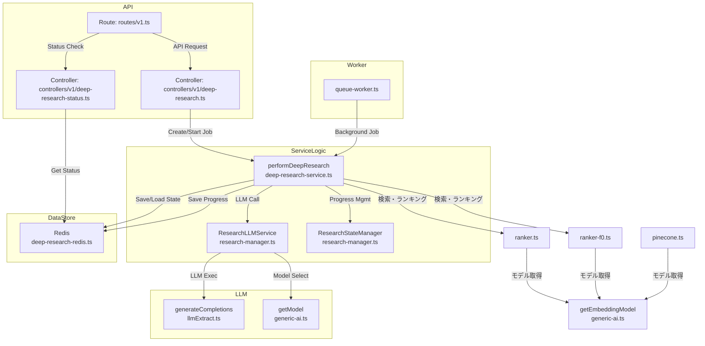

# DeepResearch 実装・拡張ガイド

## 1. DeepResearch 機能の全体像

DeepResearchは、LLM（大規模言語モデル）を活用してWebリサーチを自動化する機能です。APIリクエスト受付から検索・分析・レポート生成までを一貫して処理します。

### 構成の流れ
1. **APIエンドポイント**
    - `/deep-research` でジョブ作成、`/deep-research/:jobId` で状態取得
2. **コントローラー層**
    - deep-researchのジョブ作成・状態取得を担当
3. **サービス層**
    - `performDeepResearch` でワークフロー全体を制御
    - `ResearchLLMService` でLLMを用いた検索クエリ生成・分析・レポート作成
4. **Redis連携**
    - ジョブの進捗・状態・結果を保存/取得
5. **ワーカー層**
    - バックグラウンドでジョブ実行

---

## 1.1 ソースコードの関係図（Mermaid形式）

以下はDeepResearchの主要ソースの関係を示すMermaidダイアグラムです。



## 1.1.1 DeepResearchで使用されるプロンプト一覧

DeepResearch機能では、組み込みの3種類の主要プロンプトが使用されています。これらは`research-manager.ts`に実装されています。

| メソッド名 | 目的 | システムプロンプトの一部 | ユーザープロンプトの一部 |
|---------------|--------|-------------------|-------------------|
| `generateSearchQueries` | 検索クエリの生成 | "You are an expert research agent that generates search queries (SERP) to explore topics deeply and thoroughly. Do not generate repeated queries." | "Generate a list of 3-5 search queries to deeply research this topic: \"[topic]\". Each query should be specific and focused on a particular aspect." |
| `analyzeAndPlan` | 検索結果の分析と次のステップ計画 | "You are an expert research agent that is analyzing findings. Your goal is to synthesize information and identify gaps for further research." | "You are researching: [topic]. You have [time] minutes remaining. What has been learned? What gaps remain? What specific aspects should be investigated next?" |
| `generateFinalAnalysis` | 最終レポートの生成 | "You are an expert research analyst who creates comprehensive, well-structured reports." | "Create a comprehensive research report on \"[topic]\" based on the collected findings and analysis. Format the report in Markdown with proper headers and sections." |

各プロンプトには詳細な指示と制約が含まれており、詳細な実装は`research-manager.ts`で確認できます。また、JSONスキーマを使用して出力の構造を制御しています。

## 1.1.2 `research-manager.ts`の実装詳細

`research-manager.ts`は、DeepResearch機能の中核を担う二つの主要クラスを定義しています。

### `ResearchStateManager`クラス

このクラスは、DeepResearch処理の状態管理を担当し、以下の責務を持ちます：

- **状態の追跡**: 検索結果、発見事項、ソース、進行状況などを保持
- **進行管理**: 完了ステップ数や期待ステップ数の追跡
- **検索トピック管理**: 次に検索するトピックの設定と取得

```typescript
export class ResearchStateManager {
  private findings: DeepResearchFinding[] = [];
  private summaries: string[] = [];
  private nextSearchTopic: string = "";
  private urlToSearch: string = "";
  private currentDepth: number = 0;
  private failedAttempts: number = 0;
  private readonly maxFailedAttempts: number = 3;
  private completedSteps: number = 0;
  private totalExpectedSteps: number = 10; // デフォルト値
  private sources: DeepResearchSource[] = [];

  // ... メソッド群 ...  
}
```

主なメソッド：

- `addFinding()`: 新しい発見事項を追加
- `addActivity()`: 新しいアクティビティを追加し、Redisに状態を更新
- `setNextSearchTopic()`: 次の検索トピックを設定
- `incrementCompletedSteps()`: 完了ステップ数を増やす

### `ResearchLLMService`クラス

こちらは、AIモデルとの直接なプロンプトやレスポンスを担当するクラスです：

```typescript
export class ResearchLLMService {
  constructor(private readonly logger: Logger) {}

  // ... メソッド群 ...  
}
```

主要なメソッド：

1. **`generateSearchQueries()`** - 検索クエリの生成
   - トピックと現在の発見事項に基づいて、全体をカバーする3-5個の検索クエリを生成
   - 各クエリは特定のリサーチゴールと紐づけられる
   - 環境変数`MODEL_PROVIDER`と`MODEL_NAME`に基づいて適切なAIモデルを選択

2. **`analyzeAndPlan()`** - 検索結果の分析と次のステップ計画
   - 現在の発見事項を分析し、特定されたギャップを特定
   - 次のステップとして何を検索すべきかを推奨
   - 残り時間に基づいて研究を継続すべきか判断

3. **`generateFinalAnalysis()`** - 最終レポートの生成
   - すべての発見事項、ソース、サマリーを統合
   - マークダウン形式で文書化された論理的なレポートを作成
   - ソースの引用と適切な構造化を含む

これらのメソッドはいずれも`generateCompletions()`関数を使用して、環境変数で指定されたAIモデルと直接やり取りします。また、型付けされたJSONスキーマを使用して、AIからのレスポンスを構造化してプログラムで扱いやすくしています。

ソースコードは環境変数`MODEL_PROVIDER`と`MODEL_NAME`を適切に処理し、様々なAIプロバイダー（OpenAI、Google、Anthropicなど）を切り替えて使用できるように実装されています。

## 1.2 環境変数によるモデル設定

DeepResearchは、様々なAIモデルを柔軟に切り替えて利用できるよう設計されています。主要な環境変数とその特徴を説明します。

### 1.2.1 環境変数の概要

| 環境変数 | 用途 | 例 |
|-------------------|------|-----|
| `MODEL_PROVIDER` | 使用するAIプロバイダーを指定 | `openai`, `google`, `anthropic` |
| `MODEL_NAME` | 利用する生成AIモデル名 | `gpt-4o`, `gemini-2.5-flash-preview-04-17` |
| `MODEL_EMBEDDING_NAME` | 利用するエンベディングモデル名 | `text-embedding-3-small`, `embedding-001` |

### 1.2.2 エンベディングモデルの設定

DeepResearchのワークフローでは、検索クエリやページ内容などをベクトル化（エンベディング）する処理が含まれています。
この際、`getEmbeddingModel` 関数を通じて利用するエンベディングモデルを選択できます。

### 利用箇所

`MODEL_EMBEDDING_NAME` は主に以下の場所で利用されています：

- **検索ランキング処理**：`ranker.ts`、`ranker-f0.ts`
  - 検索結果の関連性スコアリングに使用
  - クエリとドキュメント間の意味的類似性計算に使用

- **Pineconeインデックス処理**：`pinecone.ts`
  - ドキュメントのベクトル化とインデックス作成に使用
  - 類似ドキュメント検索に使用

### 実装詳細

```typescript
// generic-ai.ts
export function getEmbeddingModel(
  name: string,
  provider: Provider = defaultProvider,
) {
  return process.env.MODEL_EMBEDDING_NAME
    ? providerList[provider].embedding(process.env.MODEL_EMBEDDING_NAME)
    : providerList[provider].embedding(name);
}
```

```typescript
// ranker.ts, ranker-f0.ts, pinecone.ts などで使用
async function getEmbedding(text: string) {
  const { embedding } = await embed({
    model: getEmbeddingModel("text-embedding-3-small"),
    value: text,
  });

  return embedding;
}
```

### Docker Composeでの設定方法

`docker-compose.yaml` で以下のように環境変数を設定します：

```yaml
environment:
  - MODEL_PROVIDER=openai  # プロバイダーの指定
  - MODEL_NAME=gpt-4o      # 生成AIモデルの指定
  - MODEL_EMBEDDING_NAME=text-embedding-3-small  # エンベディングモデルの指定
  - OPENAI_API_KEY=your_api_key_here  # 必要なAPIキー
```

### 設定しなかった場合の動作

`MODEL_EMBEDDING_NAME` を設定しない場合：

- デフォルトでは各関数内でハードコードされた値（多くの場合 `text-embedding-3-small`）が使用されます
- 機能的な制限はありませんが、特定のユースケースに最適化されたエンベディングモデルを使用できない可能性があります
- 異なるプロバイダーのエンベディングモデルを使用したい場合は設定が必要です

### 推奨設定

```
# .env ファイルの例
MODEL_EMBEDDING_NAME=text-embedding-3-small  # OpenAI
# または
MODEL_EMBEDDING_NAME=embedding-001  # Google
```

他のモデル環境変数（`MODEL_PROVIDER`、`MODEL_NAME`）と組み合わせることで、生成AIモデルとエンベディングモデルを別々に設定できます。

### 注意事項：プロバイダとモデル名の一致

**重要**: `MODEL_PROVIDER`と`MODEL_NAME`を設定する際は、互換性のある組み合わせを使用する必要があります。

```yaml
# 正しい組み合わせの例
# OpenAIプロバイダ + OpenAIモデル
- MODEL_PROVIDER=openai
- MODEL_NAME=gpt-4o
- OPENAI_API_KEY=your_api_key_here

# Googleプロバイダ + Googleモデル
- MODEL_PROVIDER=google
- MODEL_NAME=gemini-2.5-flash-preview-04-17
- GOOGLE_GENERATIVE_AI_API_KEY=your_api_key_here

# Anthropicプロバイダ + Anthropicモデル
- MODEL_PROVIDER=anthropic
- MODEL_NAME=claude-3-opus-20240229
- ANTHROPIC_API_KEY=your_api_key_here
```

**間違った組み合わせの例と発生する問題**:
```yaml
# 誤った組み合わせ
- MODEL_PROVIDER=google  # Googleプロバイダを指定
- MODEL_NAME=gpt-4o     # ⚠️ OpenAIのモデル名を指定
```

この場合、以下のようなエラーが発生します：
```
AI_APICallError: You didn't provide an API key... [OpenAIのエラー]
```

**以前の問題（修正済み）**:
DeepResearch機能の一部コードでプロバイダー情報が正しく渡されていない問題がありましたが、`research-manager.ts`の修正により解決されました。下記の必要な修正を行った結果、Google Geminiモデルなど、OpenAI以外のプロバイダーも問題なく使用できるようになりました。

```typescript
// research-manager.ts の修正例
async generateSearchQueries(...) {
  // MODEL_PROVIDER環境変数を明示的に取得
  const modelProvider = (process.env.MODEL_PROVIDER || "openai") as import("../generic-ai").Provider;
  // ...
  model: getModel(process.env.MODEL_NAME || "gpt-4o", modelProvider),
  // ...
}
```

---

### 1.2.3 モデル選択の修正とテスト結果

#### ソースコードの修正

DeepResearch機能で`MODEL_PROVIDER`環境変数を正しく反映させるための修正を行いました。主な修正点は以下の通りです。

**修正箇所：`generic-ai.ts`**

```typescript
// 修正前
type Provider = "openai" | "ollama" | "anthropic" | "google" | /* 略 */;

// 修正後
export type Provider = "openai" | "ollama" | "anthropic" | "google" | /* 略 */;
```

**修正箇所：`research-manager.ts`**

```typescript
// 修正前
async generateSearchQueries(...) {
  // MODEL_PROVIDER環境変数を利用していない
  // ...
  markdown: "",
  // プロバイダー情報が渡されていない
  // ...
}

// 修正後
async generateSearchQueries(...) {
  // MODEL_PROVIDER環境変数を明示的に取得
  const modelProvider = (process.env.MODEL_PROVIDER || "openai") as import("../generic-ai").Provider;
  // ...
  markdown: "",
  // 環境変数からモデルとプロバイダを指定
  model: getModel(process.env.MODEL_NAME || "gpt-4o", modelProvider),
  // ...
}
```

#### テスト結果

修正後、Docker Composeで以下の設定でDeepResearch機能をテストしました。

```yaml
# docker-compose.yaml
services:
  worker:
    environment:
      MODEL_PROVIDER: "google"           # Googleプロバイダーを使用
      MODEL_NAME: "gemini-2.5-flash-preview-04-17"  # Gemini 2.5プレビューモデル
      MODEL_EMBEDDING_NAME: "embedding-001"  # Google用エンベディングモデル
      GOOGLE_GENERATIVE_AI_API_KEY: "XXXXX"  # Gemini API Key
```

テストリクエスト：
```bash
curl -X POST http://localhost:3002/v1/deep-research -H "Content-Type: application/json" -d '{
  "topic": "A2A (Agent to Agent) と MCP (Model Context Protocol) の違いと特徴、ユースケース比較",
  "maxDepth": 1,
  "timeLimit": 120
}'
```

テスト結果：
- リクエスト成功，ジョブIDが生成されました
- Google Geminiモデルが正しく使用され、前回のエラー（OpenAI API Keyに関するエラー）が解消されました
- 処理が正常に進行し、検索クエリの生成やスクレイピングなどのステップがエラーなく実行されました

Dockerコンテナのログから：
```
worker-1 | 2025-04-23 07:39:35 info [deep-research-worker:processJobInternal]: 🔄 Worker extending lock on job f0a5fdb2-8442-4409-9618-9ad7baf7e7f1 
worker-1 | 2025-04-23 07:39:35 debug [deep-research:generateSearchQueries]: Generating object... 
worker-1 | 2025-04-23 07:39:35 debug [deep-research:performDeepResearch]: [Deep Research] Generated 3 search queries 
```

生成された検索クエリ：
- `A2A MCP 違い 特徴` - Goal: To get a general overview of the differences and features of A2A and MCP.
- `A2A Agent to Agent MCP Model Context Protocol 比較` - Goal: To specifically compare A2A and MCP, focusing on their core concepts and how they differ.
- `A2A MCP 技術 仕様 プロトコル` - Goal: To research the technical specifications and underlying protocols of A2A and MCP.

上記のテスト結果から、修正が正しく反映され、環境変数`MODEL_PROVIDER`と`MODEL_NAME`を用いてGoogle GeminiモデルでDeepResearch機能を利用できるようになりました。

---

## 2. LLMによる分析・検索・計画生成

### 主な機能
- **generateSearchQueries**: LLMで次に検索すべきクエリを生成
- **analyzeAndPlan**: ファインディングや残り時間から次の調査計画を生成
- **generateFinalAnalysis**: 収集した情報をもとに最終レポートを生成

いずれも `ResearchLLMService` クラスで実装され、`generateCompletions()` 関数を通じて各種プロンプト・パラメータをLLMに渡します。

## 3. LLMモデルの管理と追加

### モデル管理の仕組み
- モデルは `getModel()` 関数で抽象化
- 複数のプロバイダー（OpenAI, Anthropic, Ollama, Fireworks, Google など）に対応
- モデル名は引数または環境変数で指定可能

### getModel() の実装例
```typescript
export function getModel(name: string, provider: Provider = defaultProvider) {
  return process.env.MODEL_NAME
    ? providerList[provider](process.env.MODEL_NAME)
    : providerList[provider](name);
}
```

### モデル・プロバイダーの追加方法
1. **新しいプロバイダーを追加**
   - 対応SDKをimport
   - Provider型とproviderListに追加
2. **新しいモデル名を使う**
   - getModel("モデル名", "プロバイダー名") で呼び出し
   - または環境変数 `MODEL_NAME` を設定

#### 例: Google Geminiモデルの使用
```typescript
// ai-sdkのGemini対応プロバイダーを使用
import { google } from "@ai-sdk/google";

// Geminiモデルを使用する例
const model = getModel("gemini-2.0-pro", "google");

// 環境変数 GOOGLE_GENERATIVE_AI_API_KEY が必要
// .envファイル内で以下のように設定
// GOOGLE_GENERATIVE_AI_API_KEY=your_api_key_here
```

#### 利用可能なGemini 2.0モデル

- **gemini-2.0-pro**: 高度な推論タスク向けの最新モデル、大規模なマルチモーダル機能を備える
- **gemini-2.0-flash**: レイテンシの低い機能を備えた高速モデル
- **gemini-2.0-pro-vision**: 画像理解特化のモデル
- **gemini-2.0-pro-preview-02-05**: 先行プレビューバージョン

#### 利用可能なGemini 1.5モデル (以前のバージョン)

- **gemini-1.5-pro**: 高度な推論タスク向け、最大100万トークンコンテキスト
- **gemini-1.5-flash**: より高速で効率的な応答のための軽量モデル

#### 例: その他の独自プロバイダー追加
```typescript
import { myai } from "@ai-sdk/myai";
type Provider = ... | "myai";
const providerList: Record<Provider, any> = {
  ...,
  myai,
};
```

## 4. 参考: ディレクトリ構成と主なファイル
- `/src/lib/deep-research/` : DeepResearchの主要ロジック
- `/src/lib/generic-ai.ts` : モデル・プロバイダー管理
- `/src/controllers/v1/deep-research.ts` : エンドポイント処理
- `/src/services/queue-worker.ts` : バックグラウンドワーカー

## 5. Docker Composeでの設定方法

Docker Composeを使用してDeepResearchを実行する場合、下記のように環境変数を設定できます。

### 環境変数によるプロバイダとモデル指定

```yaml
worker:
  environment:
    # プロバイダの指定（デフォルトそ"openai"）
    MODEL_PROVIDER: "google"  # googleプロバイダーを使用
    # モデル名の指定
    MODEL_NAME: "gemini-2.0-pro"  # Gemini 2.0 Proモデルを使用
    # APIキーの設定
    GOOGLE_GENERATIVE_AI_API_KEY: ${GOOGLE_GENERATIVE_AI_API_KEY}
```

### 他のモデル設定例

```yaml
# OpenAIモデル設定例
MODEL_PROVIDER: "openai"
MODEL_NAME: "gpt-4o"
OPENAI_API_KEY: ${OPENAI_API_KEY}

# Anthropicモデル設定例
MODEL_PROVIDER: "anthropic"
MODEL_NAME: "claude-3-opus-20240229"
ANTHROPIC_API_KEY: ${ANTHROPIC_API_KEY}
```

### 設定の優先順位

プロバイダーとモデルの決定は以下の優先順位で行われます：

1. **プロバイダーの決定**
   - `MODEL_PROVIDER` 環境変数
   - OLLAMA利用時 (`OLLAMA_BASE_URL` が設定されていれば "ollama")
   - デフォルト値 ("openai")

2. **モデル名の決定**
   - `MODEL_NAME` 環境変数
   - コード内で指定されたモデル名

---

このドキュメントを参考に、DeepResearchの機能拡張やモデル追加を柔軟に行ってください。
